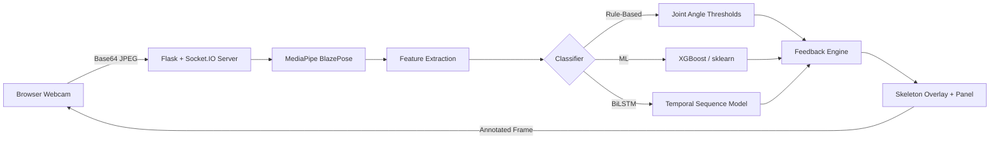

# ExerVision

Real-time exercise form evaluation using computer vision and machine learning. ExerVision analyses body pose during exercises via webcam, classifies form as correct or incorrect, and provides instant visual feedback with colour-coded joint highlights.

Built as a final-year project (BSc Computer Science, University of Greenwich).

## Features

- **10 supported exercises**: squat, lunge, deadlift, bench press, overhead press, pull-up, push-up, plank, bicep curl, tricep dip
- **3 classifier modes**: rule-based heuristics, ML (XGBoost/sklearn), and BiLSTM with temporal attention
- **Real-time feedback**: colour-coded skeleton overlay (green = correct, red = incorrect) with per-joint granularity
- **Rep counting**: automatic repetition detection and tracking per exercise
- **Session reports**: per-rep form scores, common issues summary, and session duration
- **Web interface**: browser-based UI with webcam capture, pause/resume, mirror toggle, and reconnection handling

## Architecture



## Setup

### Prerequisites

- Python 3.10+
- Webcam (for real-time mode)
- NVIDIA GPU (optional, for BiLSTM inference)

### Installation

```bash
git clone https://github.com/HamzaImdad/FYP.git
cd FYP
pip install -r requirements.txt
```

### Running the Web App

```bash
python app/server.py
```

Open http://localhost:5000 in your browser. Select an exercise, choose a classifier, and start a session.

### Command-Line Options

```bash
python app/server.py --host 0.0.0.0 --port 5000 --debug
```

## Project Structure

```
ExerVision/
├── app/                          # Web application
│   ├── server.py                 # Flask + Socket.IO server
│   ├── exercise_data.json        # Exercise metadata (muscles, instructions)
│   ├── static/
│   │   ├── app.js                # Client-side logic
│   │   ├── style.css             # UI styles
│   │   └── favicon.svg           # Brand icon
│   └── templates/
│       └── index.html            # Main page template
├── src/                          # Core library
│   ├── pose_estimation/          # MediaPipe BlazePose wrapper
│   ├── feature_extraction/       # Joint angles, temporal features, rep counting
│   ├── classification/           # Rule-based, ML, and BiLSTM classifiers
│   ├── feedback/                 # Colour-coded joint feedback engine
│   ├── visualization/            # Skeleton overlay and HUD drawing
│   ├── evaluation/               # Classifier accuracy metrics
│   ├── pipeline/                 # Real-time orchestration pipeline
│   └── utils/                    # Config, constants, geometry, temporal smoothing
├── scripts/                      # Data collection, training, and evaluation scripts
├── models/                       # Trained models and MediaPipe task files
├── data/                         # Landmark CSVs (not committed)
└── requirements.txt
```

## Classifier Comparison

| Classifier | Approach | Temporal Context | Strengths |
|---|---|---|---|
| **Rule-Based** | Hand-crafted joint angle thresholds | No | Interpretable, no training data needed, per-joint feedback |
| **ML (XGBoost)** | Trained on extracted features | No | Higher accuracy, learned decision boundaries |
| **BiLSTM** | Bidirectional LSTM with attention | Yes (30 frames) | Captures movement dynamics, attention over timesteps |

The BiLSTM classifier provides overall correct/incorrect judgment using temporal context, while per-joint colour feedback is always provided by the rule-based classifier for interpretability.

## Acknowledgements

- [MediaPipe](https://ai.google.dev/edge/mediapipe/solutions/vision/pose_landmarker) for pose estimation
- [Flask-SocketIO](https://flask-socketio.readthedocs.io/) for real-time communication
- University of Greenwich, School of Computing and Mathematical Sciences
