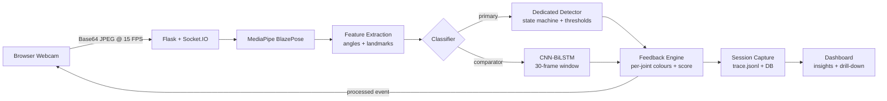

# FORMA

Real-time exercise form evaluator. Browser-based, runs locally on a consumer laptop, covers ten strength exercises, returns explainable per-joint feedback during the set rather than a grade at the end. Every webcam frame stays on the device.

Final-year project (BSc Computer Science, University of Greenwich).

## What it does

- **Real-time pose estimation** via MediaPipe BlazePose — 33 body landmarks per frame, hip-centred world coordinates in metres.
- **Ten dedicated state-machine detectors** — squat, deadlift, pull-up, push-up, plank, bicep curl, tricep dip, crunch, lateral raise, side plank. Each emits rep counts, per-joint fault codes and a continuous 0–100 form score during the set.
- **CNN-BiLSTM temporal comparator** — Conv1D front-end, two-layer BiLSTM with self-attention pooling, calibrated per-exercise thresholds on a held-out split. Serves as a learned baseline against the dedicated detectors.
- **Full-stack web app** — React 19 SPA + Flask/Socket.IO backend with JWT cookie auth, per-user SQLite persistence, session capture (`trace.jsonl` per frame), and a drill-down dashboard driven by a 15-rule insights engine.
- **Three coaching chatbots** — a personal coach that looks up your own training data, a plan creator that builds multi-week workout plans, and a public FAQ widget for logged-out visitors. Tool-dispatched, token-budgeted, and degrade gracefully without an API key.
- **Goals + milestones + badges** — six goal types, auto-generated 25/50/75/100% milestones, and 14 achievement badges fired on session completion.
- **Local-only processing** — webcam frames never leave the machine. The optional chatbot layer is the single outbound dependency, and the app runs fully offline without it.

## Architecture



One pipeline orchestrator per connected client owns the per-session state (see `src/pipeline/realtime.py`). The eight-step per-frame loop: pose estimation → visibility-weighted OneEuro smoothing → rep counting → feature extraction → classification → session tracking → feedback mapping → overlay rendering. Session traces are written per-frame to disk and replay-able for post-hoc analysis.

## Tech stack

- **Python 3.10**, Flask, Flask-SocketIO, Eventlet (for Railway WebSocket compatibility)
- **PyTorch 2** (BiLSTM training and inference), scikit-learn (baseline classifiers)
- **MediaPipe 0.10** (pose landmarker, video mode with detector-tracker cascade)
- **SQLite** (user-scoped persistence: users, sessions, reps, goals, milestones, badges)
- **React 19** + Vite 6 + Tailwind 4 + GSAP + Framer Motion + Lenis
- **OpenAI API** (chatbot tool-use, gpt-4o with gpt-4o-mini degradation; optional)
- **Docker** + Railway deployment

## Setup

### Prerequisites

- Python 3.10 or newer
- Node 20+ (only needed if you want to rebuild the React frontend)
- A webcam (for live sessions)

### Install

```bash
git clone https://github.com/HamzaImdad/FYP.git
cd FYP
pip install -r requirements.txt
```

### Configure environment

Copy the template and fill in at least `FORMA_JWT_SECRET`:

```bash
cp .env.example .env
# edit .env in your editor
```

`OPENAI_API_KEY` is optional — the three chatbots are disabled without it; every other feature runs normally.

### Build the frontend (first-time only)

The Flask server serves the React SPA from `app/static/dist/`, which is not committed (standard for Vite projects). Build it once:

```bash
cd app/web
npm install
npm run build      # writes to app/static/dist/
cd ../..
```

### Run the app

```bash
python app/server.py
```

Open `http://localhost:5000`, sign up or sign in, pick an exercise, grant camera permission, and start a set.

### Docker (one-shot deploy)

The included `Dockerfile` is multi-stage: it builds the React frontend, installs Python deps, and runs the server. Railway-ready.

```bash
docker build -t forma .
docker run -p 5000:5000 --env-file .env forma
```

### Frontend development (optional)

```bash
cd app/web
npm run dev         # Vite dev server on :5173, proxies /api + /socket.io to Flask :5000
npm run typecheck   # strict TS check, no emit
```

## Project structure

```
FYP/
├── app/                            Web application
│   ├── server.py                   Flask + Socket.IO entry point
│   ├── auth.py                     JWT cookie auth, bcrypt hashing
│   ├── database.py                 SQLite schema + per-user queries
│   ├── session_capture.py          Per-frame trace.jsonl writer
│   ├── insights.py                 15 dashboard insight rules
│   ├── goal_engine.py              Goals + milestones
│   ├── badge_engine.py             14 achievement badges
│   ├── chat_engine.py              Chatbot SSE streaming + tool dispatch
│   ├── chat_tools.py               Coach + plan-creator tool definitions
│   ├── public_chat.py              Logged-out RAG chatbot
│   ├── exercise_registry.py        Canonical exercise metadata
│   └── web/                        React 19 SPA source (Vite, TS, Tailwind)
├── src/                            Core library (imported by app + scripts)
│   ├── pose_estimation/            MediaPipe wrapper
│   ├── feature_extraction/         Angles, landmarks, rep counting
│   ├── classification/             10 dedicated detectors + BiLSTM + rule-based
│   ├── feedback/                   Score → text/colour mapping
│   ├── visualization/              Skeleton overlay + HUD drawing
│   ├── pipeline/                   Real-time orchestration
│   └── utils/                      Geometry, temporal smoothing, constants
├── scripts/                        Training, evaluation, data-pipeline scripts
├── tests/                          Pytest suites (geometry, detectors, pipeline)
├── models/
│   ├── mediapipe/                  pose_landmarker_*.task
│   └── trained/                    *_bilstm_v2.pt (ten BiLSTM models)
├── reports/                        Evaluation artefacts (F1 tables, curves, figures)
├── docs/                           Reference material
├── Dockerfile                      Multi-stage build (React + Flask)
├── requirements.txt
└── README.md
```

The ten detectors live in `src/classification/{squat, deadlift, pullup, pushup, plank, bicep_curl, tricep_dip, crunch, lateral_raise, side_plank}_detector.py`, all inheriting from `base_detector.py`'s `RobustExerciseDetector` (apart from `pushup_detector.py`, a pre-refactor standalone implementation kept on its original interface).

## Evaluation

The dedicated detectors are the primary classification path; the CNN-BiLSTM is evaluated on held-out test data with per-exercise threshold calibration on a separate split. Dedicated detectors run at ~82 FPS on an i7-14700HX (angle arithmetic, no tensor inference); the BiLSTM backend runs at ~35 FPS, comfortably above the 20 FPS real-time floor.

Full evaluation — per-exercise F1/precision/recall, confusion matrices, threshold sweeps, v1-vs-v2 training curves, cross-exercise pretraining ablations, FPS benchmarks, user-study findings — is in the dissertation.

## Acknowledgements

- [MediaPipe](https://ai.google.dev/edge/mediapipe/solutions/vision/pose_landmarker) for the pose landmarker
- [Flask-SocketIO](https://flask-socketio.readthedocs.io/) for real-time transport
- University of Greenwich, School of Computing and Mathematical Sciences
